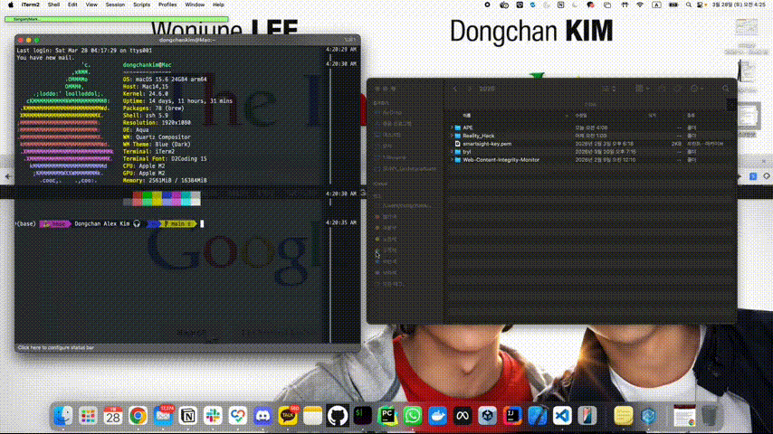

# A.P.E

[](https://github.com/Dongckim/A.P.E/actions/workflows/ci.yml)
[](https://github.com/Dongckim/A.P.E/releases/latest)
[](LICENSE)
[](https://go.dev)
[](https://react.dev)

**AWS Platform Explorer** — browse EC2 files and S3 buckets from your browser.

> Tired of typing `scp` commands and switching between terminal tabs to manage EC2 files? A.P.E gives you a visual file manager that runs locally and just works.

```
$ ape

          ▄▄██████████▄▄
        ▄████████████████▄
       ████████████████████
       ███  (◕)    (◕)  ███
       ████     ▄▄     ████
        ████ ┌──────┐ ████
         ████│ ━━━━ │████
          ▀██└──────┘██▀
            ▀████████▀

  ⏺ Connected to ubuntu@54.123.45.67
  ⏺ Web UI ready at http://localhost:9000
```

One binary. Connect via SSH. Get a Finder-like GUI at `localhost:9000`.



## Quick Start

### Homebrew (macOS)

```bash
brew tap dongckim/tap
brew install ape
ape
```

### Manual Download

```bash
# macOS Apple Silicon
curl -sL https://github.com/Dongckim/A.P.E/releases/latest/download/ape-darwin-arm64.tar.gz | tar xz
./ape
```

### Build from Source

```bash
git clone https://github.com/Dongckim/A.P.E.git && cd A.P.E
make build
./bin/ape
```

## What it does

```
┌─────────────┐       ┌──────────────┐
│   Browser    │◄─────►│  A.P.E (Go)  │
│  :9000       │       │  localhost    │
└─────────────┘       └──┬────────┬──┘
                    SSH/SFTP    AWS SDK
                         │         │
                    ┌────▼──┐  ┌──▼───┐
                    │  EC2  │  │  S3  │
                    └───────┘  └──────┘
```

- **EC2**: Browse, upload, download, edit, rename, delete files via SFTP
- **S3**: List buckets, navigate objects, upload/download/delete
- **Editor**: Built-in Monaco editor with syntax highlighting
- **Security**: SSH keys never leave your machine. Server binds to localhost only.

## Features

- Finder-style file explorer (grid + list view)
- Drag & drop upload with progress bar
- Right-click context menu
- Monaco text editor (Cmd+S to save)
- S3 bucket browser
- Multi-select (Shift/Cmd+click)
- Keyboard shortcuts (Cmd+N, Delete, Cmd+C)
- Multiple EC2 connections
- Single 16MB binary (frontend embedded)

## CLI Commands

```
ape ▸ /add      connect additional EC2
ape ▸ /list     list active connections
ape ▸ /status   show connection info
ape ▸ /q        quit
```

## Tech

Go + React + TypeScript + Tailwind + Monaco Editor + Vite

`golang.org/x/crypto/ssh` | `github.com/pkg/sftp` | `aws-sdk-go-v2`

## Contributing

See [CONTRIBUTING.md](CONTRIBUTING.md). Issues and PRs welcome.

## License

MIT
